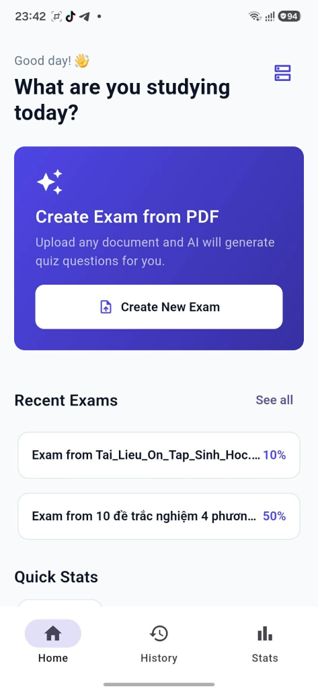
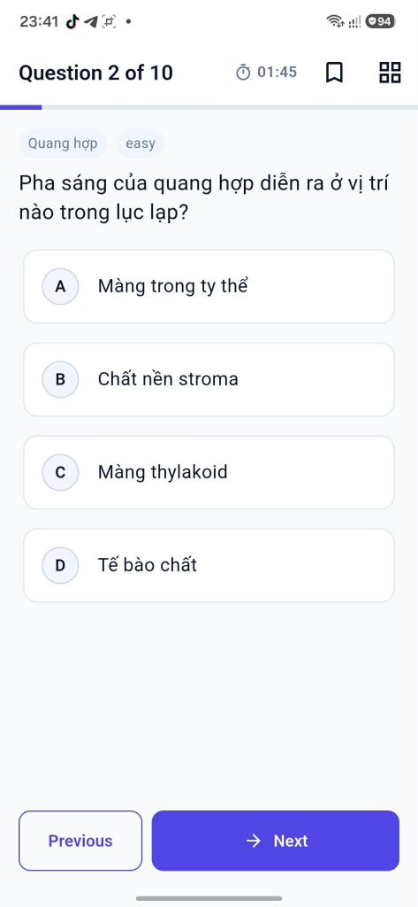
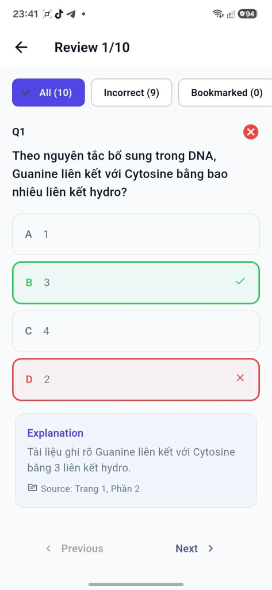
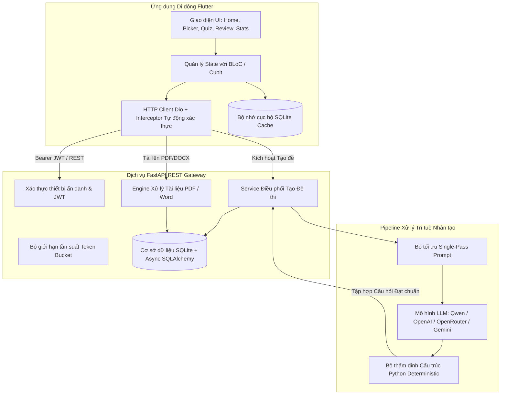

# Testo — Nền tảng Ôn luyện & Tự động Tạo Đề thi bằng Trí tuệ Nhân tạo (AI)

<p align="center">
  
</p>

<p align="center">
  
  
  
  
  
  
</p>

---

## ⚡ Tổng quan Dự án (Overview)

**Testo** là một nền tảng giáo dục di động chuẩn production, tích hợp AI thông minh giúp chuyển đổi trực tiếp mọi tài liệu học tập (PDF, Word DOCX) thành các bộ đề thi trắc nghiệm bám sát chương trình học chỉ trong **chưa đầy 5 giây**. 

Khác với các công cụ tạo đề thông thường thực hiện nhiều vòng gọi LLM chậm chạp làm cạn kiệt hạn ngạch API (15–25 round trips mất từ 3–5 phút), Testo áp dụng kỹ thuật **Tối ưu hóa Single-Pass Prompt** kết hợp cùng **Bộ thẩm định Deterministic Validation cục bộ bằng Python**, cung cấp các câu hỏi học thuật chất lượng cao, các phương án nhiễu logic và trích dẫn giải thích nguồn chuẩn xác chỉ với **duy nhất 1 request AI**.

---

## 📥 Tải xuống & Trải nghiệm Thực tế

| Tài nguyên | Mô tả chi tiết | Liên kết tải về |
| :--- | :--- | :--- |
| **Android APK** | Bản phát hành chính thức v1.5.0 (Cài đặt ngay trên Android 8.0+) | [⬇️ Tải file `testo-v1.5.0.apk`](testo-v1.5.0.apk) |
| **Tài liệu mẫu (Word)** | Tài liệu ôn tập Sinh học với kiến thức tế bào, quang hợp, ADN chuẩn SGK | [📄 Tải file `Tai_Lieu_On_Tap_Sinh_Hoc.docx`](Tai_Lieu_On_Tap_Sinh_Hoc.docx) |
| **Tài liệu mẫu (PDF)** | Phiên bản PDF tương ứng của tài liệu ôn tập | [📑 Tải file `Tai_Lieu_On_Tap_Sinh_Hoc.pdf`](Tai_Lieu_On_Tap_Sinh_Hoc.pdf) |
| **Kiến trúc Hệ thống** | Thiết kế System Design, luồng dữ liệu & sơ đồ cơ sở dữ liệu ERD | [🏗️ Xem tài liệu Kiến trúc](docs/ARCHITECTURE.md) |
| **Đặc tả REST API** | Hợp đồng giao tiếp endpoints & schemas chuẩn OpenAPI | [🔌 Xem đặc tả API](docs/API_SPECIFICATION.md) |

---

## 📱 Trải nghiệm Ứng dụng & Ảnh chụp Màn hình (App Walkthrough)

<p align="center">
  
  &nbsp;&nbsp;&nbsp;&nbsp;&nbsp;&nbsp;&nbsp;&nbsp;
  
</p>

| ⏱️ 1. Giao diện Thi trắc nghiệm Bấm giờ | 🎯 2. Đánh giá Chi tiết & Trích dẫn Nguồn |
| :--- | :--- |
| **Trải nghiệm thi tương tác mượt mà**<br>• Đồng hồ đếm ngược thời gian thực & thanh điều hướng câu hỏi<br>• Tự động phân loại chủ đề & nhãn độ khó (`Quang hợp`, `easy`)<br>• Tự động lưu tiến độ làm bài offline qua SQLite | **Thẩm định chuẩn kiến thức học thuật**<br>• Phản hồi trực quan đáp án đúng / sai tức thì<br>• Giải thích sư phạm cặn kẽ cho từng lựa chọn<br>• **Trích dẫn chính xác trang nguồn** (`Source: Trang 1, Phần 2`) |

---

## 🏗️ Kiến trúc Hệ thống (System Architecture)



---

## 🌟 Điểm sáng Kỹ thuật & Tối ưu hóa (Key Highlights)

### 1. ⚡ Pipeline AI 1-Pass Tốc độ cao (Single-Pass 1-Call)
* Các giải pháp truyền thống thường chia nhỏ quy trình gọi LLM: 1 lần phân tích nội dung + 1 lần cho từng chương + 1 lần cho mỗi 5 câu hỏi để thẩm định (**tổng cộng 15–25 lần gọi AI**, mất 3–5 phút, dễ chạm ngưỡng rate limit).
* **Giải pháp của Testo**: Tổng hợp toàn bộ đề thi chỉ trong **đúng 1 request AI** nhờ kỹ thuật ép khuôn định dạng JSON có cấu trúc nghiêm ngặt. Việc kiểm tra cấu trúc (4 lựa chọn không trùng lặp, chỉ số đáp án hợp lệ từ `0..3`, độ dài phần giải thích, thuật toán fuzzy loại bỏ câu trùng lặp) đều được xử lý cục bộ bằng Python (`< 1ms`).
* **Kết quả**: Thời gian sinh đề giảm từ vài phút xuống còn **~3–5 giây**, tiết kiệm tối đa chi phí và chỉ tiêu hao 1 credit API.

### 2. 🛡️ Bộ lọc Nhiễu & Cơ chế Chống Sinh Ảo giác (Anti-Hallucination Guardrails)
* Tài liệu giáo trình học tập thực tế thường chứa nhiều thông tin phụ: tên tác giả, quảng cáo khóa học, website (`tenschool.vn`), thông báo livestream và hình mờ watermark.
* Testo tích hợp tiền xử lý chuẩn hóa văn bản tự động bằng Regex, bóc tách và loại bỏ hoàn toàn các đoạn văn rác/quảng cáo trước khi đưa vào ngữ cảnh AI.
* Prompt kỹ thuật số đặt ra các ràng buộc nghiêm ngặt: **chỉ tạo câu hỏi trọng tâm kiến thức học thuật**, nghiêm cấm tạo các câu hỏi liên quan đến thông tin bên lề, tác giả hoặc thời gian phát sóng.

### 3. 📱 Ứng dụng Di động Flutter Chuẩn Doanh nghiệp
* **Clean Architecture**: Phân tách rõ ràng giữa các tầng Presentation (Widgets & BLoC), Domain (Entities & Use Cases), và Data (DTOs, Repositories, Data Sources).
* **Offline-First Resilience**: Đề thi và câu trả lời của người dùng được lưu trữ cục bộ qua `sqflite`, đảm bảo không bị gián đoạn hay mất kết quả ngay cả khi mất kết nối mạng bất ngờ.
* **Mạng lưới chịu lỗi cao**: Interceptor tùy biến trên `Dio` tự động làm mới access token thiết bị trong suốt phiên làm việc và kích hoạt cơ chế thử lại lũy thừa (Exponential Backoff).
* **Cấu hình Máy chủ Linh hoạt**: Tích hợp hộp thoại cấu hình địa chỉ IP máy chủ mạng LAN trực tiếp trong app, hỗ trợ kiểm thử tiện lợi trên thiết bị thật.

---

## 💻 Ngăn xếp Công nghệ (Tech Stack)

| Tầng công nghệ | Công nghệ sử dụng |
| :--- | :--- |
| **Mobile Client** | Flutter 3.x, Dart, BLoC / Cubit, GoRouter, Dio, SQFlite, FilePicker |
| **Backend API** | Python 3.11, FastAPI, Pydantic v2, SQLAlchemy 2.0 (Async), Uvicorn |
| **Cơ sở dữ liệu** | SQLite + `aiosqlite` (bật chế độ WAL), Migration với Alembic |
| **AI / LLM** | OpenAI API SDK (`AsyncOpenAI`), Qwen 3.8-Flash, OpenRouter, Google GenAI |
| **Xử lý Tài liệu** | `pdfplumber`, `pypdf`, `python-docx` |
| **Kiểm thử & CI/CD** | Pytest (đạt 41/41 unit & integration tests), Flutter Widget/Unit tests |

---

## 🚀 Hướng dẫn Cài đặt & Chạy Ứng dụng Mobile

### Yêu cầu môi trường
* Flutter SDK (phiên bản 3.x trở lên)
* Android SDK (compileSdk 36, Java 17 hoặc 21)
* Thiết bị Android thật (đã bật USB Debugging) hoặc máy ảo Android Emulator

### Các bước khởi chạy
```bash
# 1. Clone mã nguồn dự án
git clone https://github.com/drim1210/Testo.git
cd Testo/mobile

# 2. Cài đặt các gói thư viện phụ thuộc
flutter pub get

# 3. Chạy ứng dụng trên thiết bị
flutter run
```

---

## 📄 Bản quyền & Sở hữu Trí tuệ (License)
Bản quyền © 2026 Dự án Testo. Đã đăng ký bản quyền.  
Mã nguồn ứng dụng Flutter, hệ thống thiết kế và tài liệu kiến trúc được công khai nhằm mục đích giới thiệu năng lực kỹ thuật và đánh giá chuyên môn của nhà tuyển dụng.
