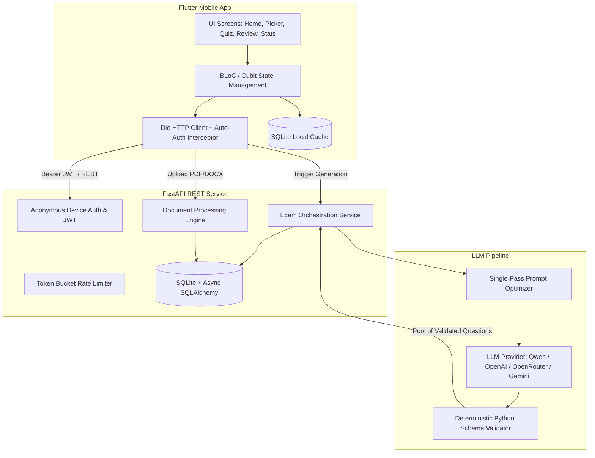

# Testo — AI-Powered Learning & Exam Generation Platform

<p align="center">
  
  &nbsp;&nbsp;&nbsp;&nbsp;
  
  &nbsp;&nbsp;&nbsp;&nbsp;
  
</p>

<p align="center">
  
  
  
  
  
  
</p>

---

## ⚡ Overview

**Testo** is a production-grade, AI-powered educational mobile platform that transforms learning documents (PDF, Word DOCX) into interactive, syllabus-aligned multiple-choice practice exams in **under 5 seconds**. 

Unlike conventional exam generators that execute slow, quota-exhausting multi-call loops (15–25 round trips taking minutes), Testo employs a high-efficiency **Single-Pass Prompt Optimization** paired with an instant **Deterministic Local Validation Engine**, delivering high-accuracy academic questions, distractors, and explanatory citations with strictly **1 single AI request**.

---

## 📥 Downloads & Quick Test

| Artifact | Description | Link |
| :--- | :--- | :--- |
| **Android APK** | Release build v1.5.0 (Ready to install on Android 8.0+) | [⬇️ Download `testo-v1.5.0.apk`](testo-v1.5.0.apk) |
| **Sample Document (Word)** | Biology review document with clear academic concepts | [📄 Download `Tai_Lieu_On_Tap_Sinh_Hoc.docx`](Tai_Lieu_On_Tap_Sinh_Hoc.docx) |
| **Sample Document (PDF)** | Matching PDF version of the test document | [📑 Download `Tai_Lieu_On_Tap_Sinh_Hoc.pdf`](Tai_Lieu_On_Tap_Sinh_Hoc.pdf) |
| **System Architecture** | Detailed system design, data flow & ERD | [🏗️ Read Architecture Docs](docs/ARCHITECTURE.md) |
| **API Specification** | Complete REST endpoints & schemas contract | [🔌 Read API Docs](docs/API_SPECIFICATION.md) |

---

## 📱 App Walkthrough & Screenshots

<p align="center">
  
  &nbsp;&nbsp;&nbsp;&nbsp;
  
  &nbsp;&nbsp;&nbsp;&nbsp;
  
</p>

| 🏠 1. Home Dashboard | ⏱️ 2. Interactive Timed Quiz | 🎯 3. In-Depth Review & Citations |
| :--- | :--- | :--- |
| **Instant Exam Access & Quick Stats**<br>• One-tap document upload (`PDF`, `DOCX`)<br>• Recent exam history & performance overview<br>• Clean Material 3 design system | **Adaptive Exam Experience**<br>• Real-time countdown timer & question navigator<br>• Topic classification & difficulty badges<br>• Offline-first response tracking via SQLite | **Syllabus-Aligned Verification**<br>• Instant feedback on correct/incorrect choices<br>• Detailed pedagogical explanations<br>• **Source page citation** (`Source: Trang 1, Phần 2`) |

---

## 🏗️ System Architecture



---

## 🌟 Key Engineering Innovations

### 1. ⚡ Single-Pass 1-Call AI Pipeline
* Traditional architectures execute multiple LLM calls: 1 for content analysis + 1 per chapter + 1 per 5 questions for validation (**15–25 calls total**, ~4 minutes, exhausts daily quotas).
* **Testo's Solution**: Synthesizes the entire exam in **1 single LLM call** using structured JSON output constraints. Structural schema checks (4 unique options, valid `0..3` answer index, minimum explanation length, fuzzy duplicate detection) run locally in Python (`< 1ms`).
* **Result**: Exam generation drops from 4 minutes to **~3–5 seconds** while consuming only 1 API credit.

### 2. 🛡️ Noise Filtering & Anti-Hallucination Guardrails
* Raw educational PDFs often contain instructor promotions, website domains (`tenschool.vn`), livestream notifications, and watermarks.
* Testo automatically normalizes text streams with regex filters, removing boilerplate before the prompt is constructed.
* Prompt engineering strictly enforces: **academic curriculum questions only**, prohibiting questions about metadata, author names, or publishing dates.

### 3. 📱 Enterprise-Grade Flutter Mobile Client
* **Clean Architecture**: Clear separation across Presentation (Widgets & BLoCs), Domain (Entities & Use Cases), and Data (DTOs, Repositories, Data Sources).
* **Offline First**: Tests and answers are stored locally using `sqflite` so quiz-takers never lose progress due to intermittent network drops.
* **Resilient Networking**: Custom `Dio` interceptors handle seamless device authentication token refreshes and exponential backoff retry.
* **Dynamic Server Configuration**: Built-in LAN discovery & IP configuration dialog for seamless device testing.

---

## 💻 Tech Stack

| Layer | Technologies |
| :--- | :--- |
| **Mobile Client** | Flutter 3.x, Dart, BLoC / Cubit, GoRouter, Dio, SQFlite, FilePicker |
| **Backend API** | Python 3.11, FastAPI, Pydantic v2, SQLAlchemy 2.0 (Async), Uvicorn |
| **Database** | SQLite + `aiosqlite` (WAL mode enabled), Alembic migrations |
| **AI / LLM** | OpenAI API SDK (`AsyncOpenAI`), Qwen 3.8-Flash, OpenRouter, Google GenAI |
| **Document Processing** | `pdfplumber`, `pypdf`, `python-docx` |
| **Testing & CI/CD** | Pytest (41/41 unit & integration tests passing), Flutter Unit/Widget tests |

---

## 🚀 Running the Mobile Project Locally

### Prerequisites
* Flutter SDK (3.x or higher)
* Android SDK (compileSdk 36, Java 17/21)
* Connected Android device or emulator

### Getting Started
```bash
# 1. Clone repository
git clone https://github.com/drim1210/Testo.git
cd Testo/mobile

# 2. Install dependencies
flutter pub get

# 3. Run on connected device
flutter run
```

---

## 📄 License & Intellectual Property
Copyright © 2026 Testo Project. All rights reserved.  
The source code for the Flutter mobile application, design system, and architecture documentation is published for portfolio and technical evaluation purposes.
