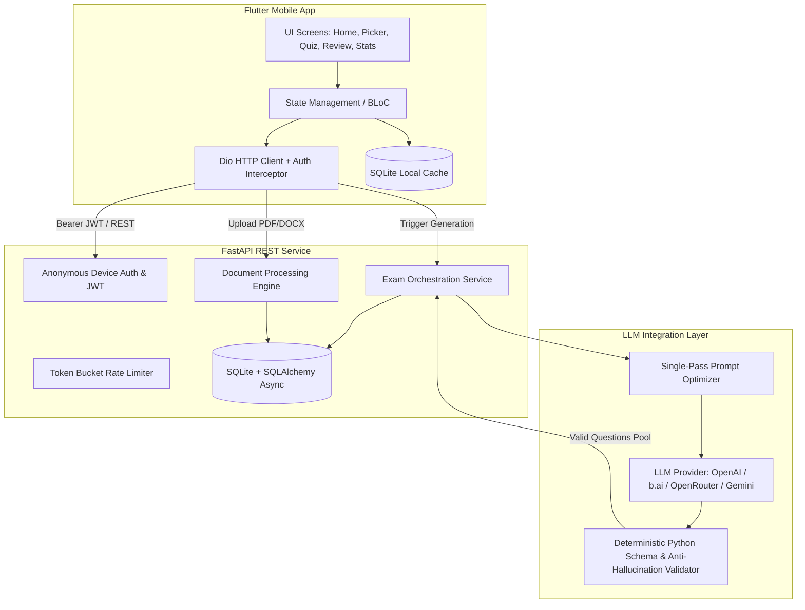
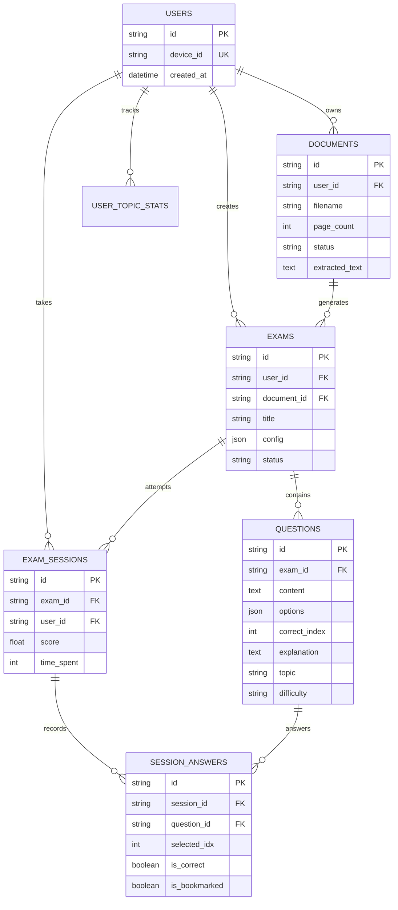

# Testo System Architecture & Design Specification

## 1. System Overview

**Testo** is an AI-powered document-to-exam generation and adaptive practice platform. Users upload learning materials (PDF, Word DOCX) and receive a high-quality, syllabus-aligned multiple-choice examination, complete with detailed explanations, topic classifications, and difficulty ratings.



---

## 2. Mobile Architecture (Flutter)

The mobile application is designed following **Clean Architecture** and **Feature-First** principles:

### Key Design Patterns & Packages
* **State Management**: BLoC / Cubit pattern for predictable unidirectional data flow.
* **Navigation**: Declarative routing with `go_router`, deep-linking and state restoration support.
* **Networking**: `dio` client with custom interceptors:
  * `AuthInterceptor`: Seamless anonymous device authentication. If access token expires, automatically acquires new credentials without user interruption.
  * `RetryInterceptor`: Exponential backoff on transient network failures.
* **Local Persistence**: `sqflite` for offline quiz caching, bookmark synchronization, and local session review.
* **Design System**: Strict design tokens (`AppColors`, `AppSpacing`, `AppTypography`) ensuring 100% consistent spacing, typography, and contrast.

### Directory Structure
```
mobile/lib/
├── core/
│   ├── api/             # Dio client, interceptors, error mappers
│   ├── config/          # AppConfig, GoRouter routes, constants
│   └── theme/           # AppColors, AppSpacing, AppTypography
├── data/
│   ├── models/          # Strongly-typed immutable data classes
│   └── repositories/    # Abstract repositories & remote implementations
├── features/
│   ├── splash/          # App initialization & auth check
│   ├── home/            # Overview, quick-start, recent exams
│   ├── document_picker/ # Multi-format file picker (PDF, DOCX) & upload
│   ├── exam_config/     # Difficulty, question count & topic selection
│   ├── generating/      # Real-time progress polling with cancel support
│   ├── quiz/            # Timed exam interface, bookmarking, auto-save
│   ├── result/          # Score calculation, strong/weak topic breakdown
│   ├── review/          # Answer review with explanations & source citations
│   └── stats/           # Historical learning progress & topic mastery
└── shared/
    └── widgets/         # AppButton, AppCard, ServerConfigDialog, Progress
```

---

## 3. Backend Architecture & AI Pipeline

### A. Document Ingestion & Noise Filtering
* **PDF Processing**: Uses `pdfplumber` for structured text-layer extraction. Verbose library logging is suppressed at import time to prevent event-loop I/O starvation.
* **Word (DOCX) Processing**: Uses `python-docx` to extract paragraphs, structural headings, and section breaks into normalized chunks.
* **Heuristic Noise Filter**: Strips boilerplate headers/footers, course advertising, instructor names, phone numbers, and URLs so the LLM is fed pure academic content.

### B. Single-Pass 1-Call LLM Generation
Previous multi-step architectures required 15–25 round trips to the LLM (analyzing chapters, querying each topic, and validating every 5 questions). Testo uses a **Single-Pass Prompt Optimization**:
1. **1 Single AI Call**: The LLM receives the entire document context and generates all requested questions in a structured JSON array conforming to strict educational schemas.
2. **Local Python Validation (0 AI Calls)**: Structural checks (4 distinct options, valid answer index `0..3`, minimum explanation length, duplicate detection via `difflib.SequenceMatcher`) run locally in `< 1ms`.
3. **Follow-Up (At most 1 Call)**: If the LLM generates fewer questions than requested, a single top-up call is triggered.

---

## 4. Database Schema (ERD)



---

## 5. Security & Reliability Highlights
* **IDOR Prevention**: All queries enforce tenant isolation via `user_id` validation from the verified JWT.
* **Rate Limiting**: In-memory token bucket rate limiting on authentication and exam generation endpoints.
* **Magic Byte Verification**: File uploads strictly verify MIME signatures (`%PDF-` for PDF, `PK\x03\x04` for DOCX) rather than trusting client extensions.
* **Zero Secret Leakage**: All keys and credentials are kept strictly in environment variables; none are tracked in version control.
